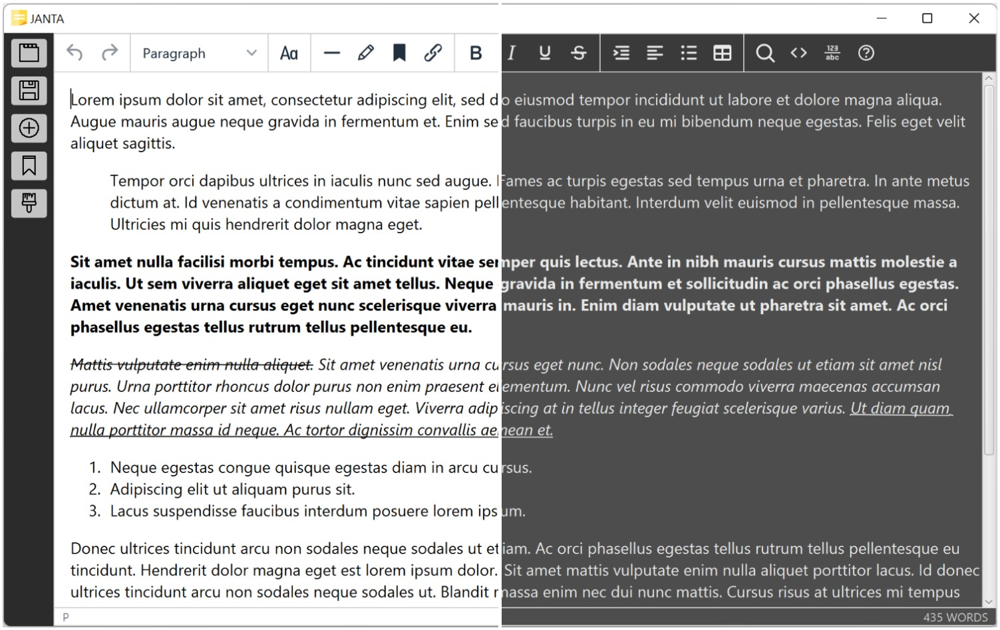
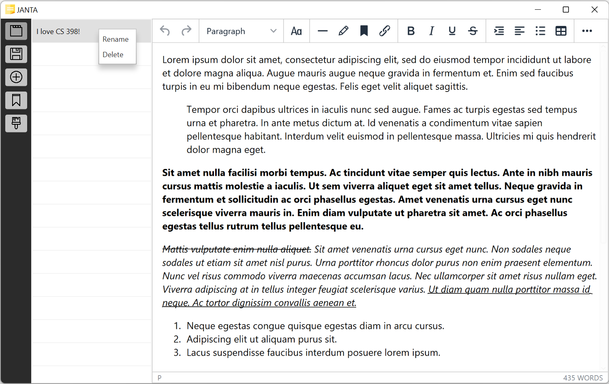

# Team 110:
- Logan Maier
- Yichuan Qiu
- Ivan Shan
- Yixin Li

# Table of Contents

1. [Introduction](#int)
2. [Instructions](#ins)
3. [Development Process](#dev)
4. [Ackowledgements](#ack)

# JANTA: Just Another Note Taking App<a name="int"/>

JANTA is a full featured, note taking app targeted towards students taking notes for various academic curricula. Its features include Rich Text editing, autosave, and an awesome aesthetic (thanks to Yixin ^_^). Also included in JANTA is an intuitive annotation and labeling system designed to allow users to structure and navigate notes in a manner uniquely suited to textbook-based content. JANTA is primarily written in Kotlin, but works with HTML under the hood using a WebEngine, allowing it to cleanly handle copy & pasting from webpages and other HTML editors.

# Instructions<a name="ins"/>

JANTA's interface should be fairly self explanatory. Regardless, below is a quick all-you-need-to-know.

The sidebar buttons, in order:

1. Toggle note list1
2. Save current note2
3. Create new note
4. Toggle label list3
5. Toggle theme

1 Notes can be renamed and deleted by right clicking on the corresponding note in the note list.

2 JANTA saves the content in the current note any time you switch notes. Saving is also triggered by content commits; virtually any action taken in editor including clicking, applying a font, indenting, etc. Thus, the only time where you should manually save is when you intend to close the app immediately after typing a large amount of text.

3 The label list displays the label targets and references within the currently open note.

## Annotations and Labels

Refer to the [dedicated wiki page](https://git.uwaterloo.ca/y2679li/cs398-project/-/wikis/Annotations-and-Labels) for details.

## Shortcuts

| Action | Shortcut |
| ---      | ---      |
| **Bold** | Ctrl + B |
| *Italic* | Ctrl + I |
| <ins>Underline</ins> | Ctrl + U |
| Annotate | Ctrl + P |
| Label target | Ctrl + L |
| Label reference | Ctrl + O |
| Select all | Ctrl + A |
| Redo | Ctrl + Y or Ctrl + Shift + Z |
| Undo | Ctrl + Z |
| <h1>Heading 1</h1> | Shift + Alt + 1 |
| <h2>Heading 2</h2> | Shift + Alt + 2 |
| <h3>Heading 3</h3> | Shift + Alt + 3 |
| <h4>Heading 4</h4> | Shift + Alt + 4 |
| <h5>Heading 5</h5> | Shift + Alt + 5 |
| <h6>Heading 6</h6> | Shift + Alt + 6 |
| Paragraph | Shift + Alt + 7 |
| Open help dialog | Alt + 0 |
| Find | Ctrl + F |

# Development Process<a name="dev"/>

In the opening weeks of the course, we brainstormed for a rough direction that we wanted to take our app towards, before settling on the idea of JANTA. We interviewed our friends for features they, as students, would like to see implemented in the app, then reviewed their responses to assemble a list of requirements as well as their technical implications. The repository was set up by converting the requirements into issues, with various labels created in order to organize tasks by type and priority. Finally, we came together to plan out the app's architecture, design, and data schema. The relevant documents can be found in [our drive](https://drive.google.com/drive/folders/1ai-ndyGoGxES07YCx32XlK39CXr1TEIi?usp=sharing), as well as our [resources channel](https://discord.gg/aaXfgXjzFT).

The app was then built over the course of three two-week sprints, with us meeting for standups thrice a week. We set goals in terms of feature completion for each sprint, and presented our progress to course staff at the end of each sprint. We regularly met with each other to pair program and review code. For better or for worse, much pre-emptive refactoring was done as the codebase grew more complex. See the sprint release pages for more details.

## Major Project Stages

- [Requirements](https://gitlab.uwaterloo.ca/y2679li/cs398-project/-/wikis/Requirements)
- [Analysis & Design](https://gitlab.uwaterloo.ca/y2679li/cs398-project/-/wikis/Analysis-&-Design)
- [Implementation](https://gitlab.uwaterloo.ca/y2679li/cs398-project/-/wikis/Implementation)
- [Testing](https://gitlab.uwaterloo.ca/y2679li/cs398-project/-/wikis/Testing)

## Sprint Releases

- [Sprint 1](https://gitlab.uwaterloo.ca/y2679li/cs398-project/-/wikis/Sprint-1)
- [Sprint 2](https://gitlab.uwaterloo.ca/y2679li/cs398-project/-/wikis/Sprint-2)
- [Sprint 3](https://gitlab.uwaterloo.ca/y2679li/cs398-project/-/wikis/Sprint-3)

# Ackowledgements<a name="ack"/>

- [TinyMCE](https://github.com/tinymce/tinymce)
- [Stackoverflow](https://stackoverflow.com/)
