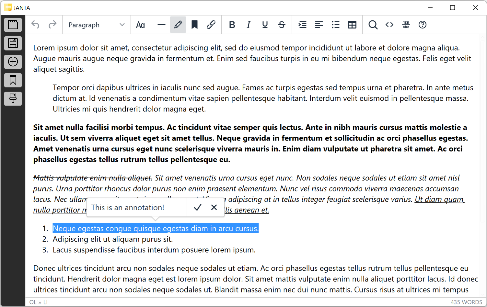
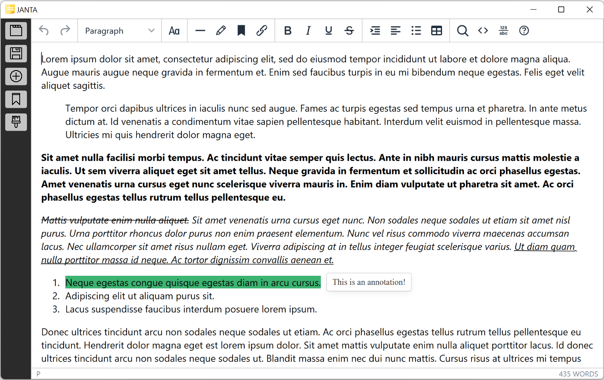
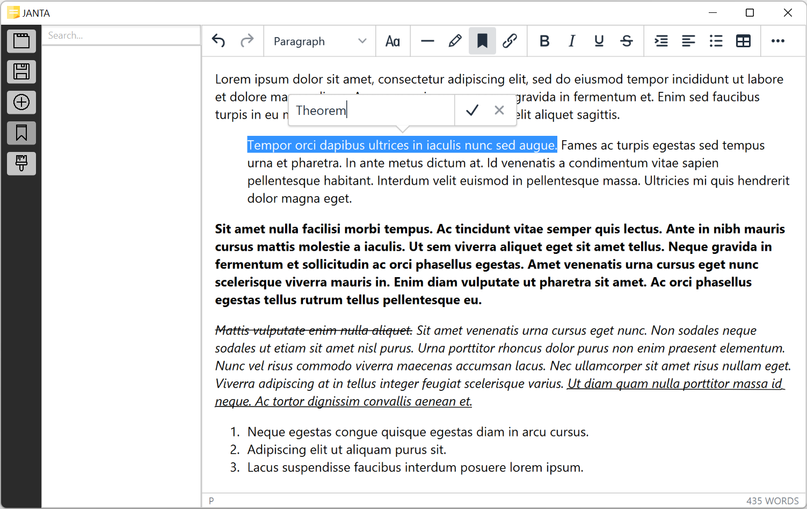
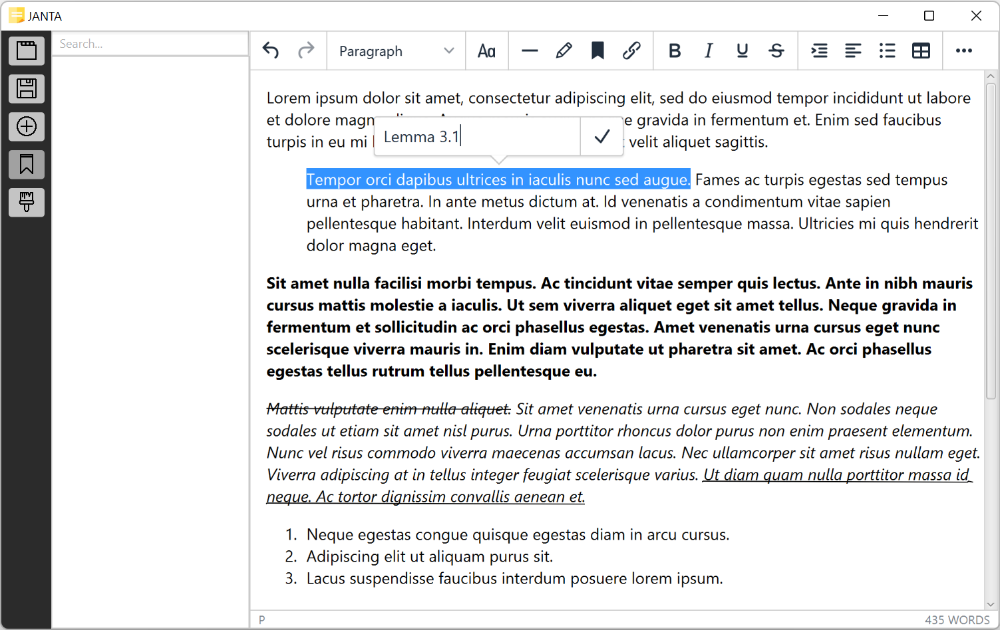
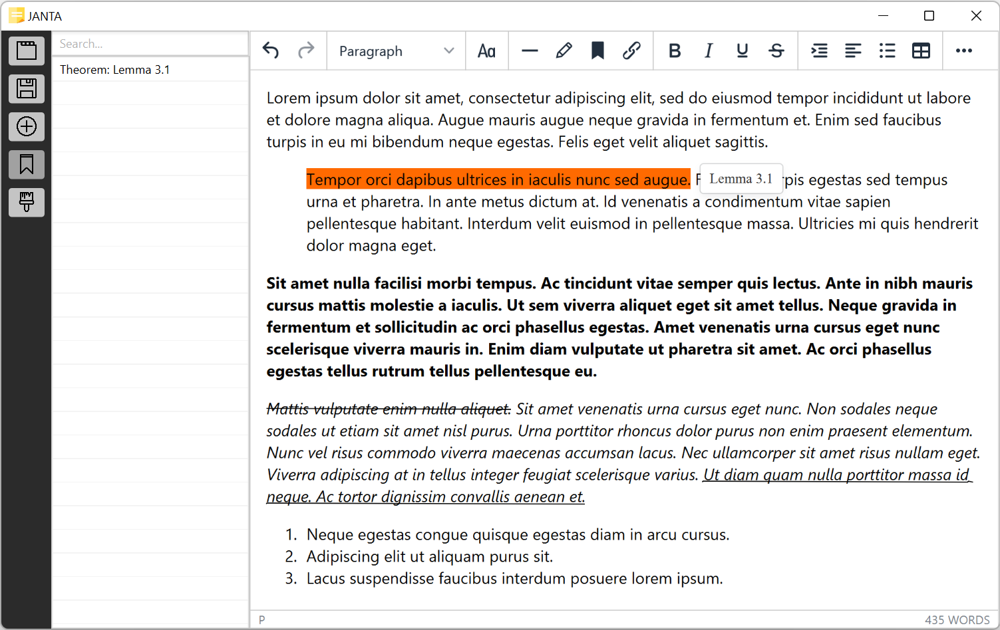
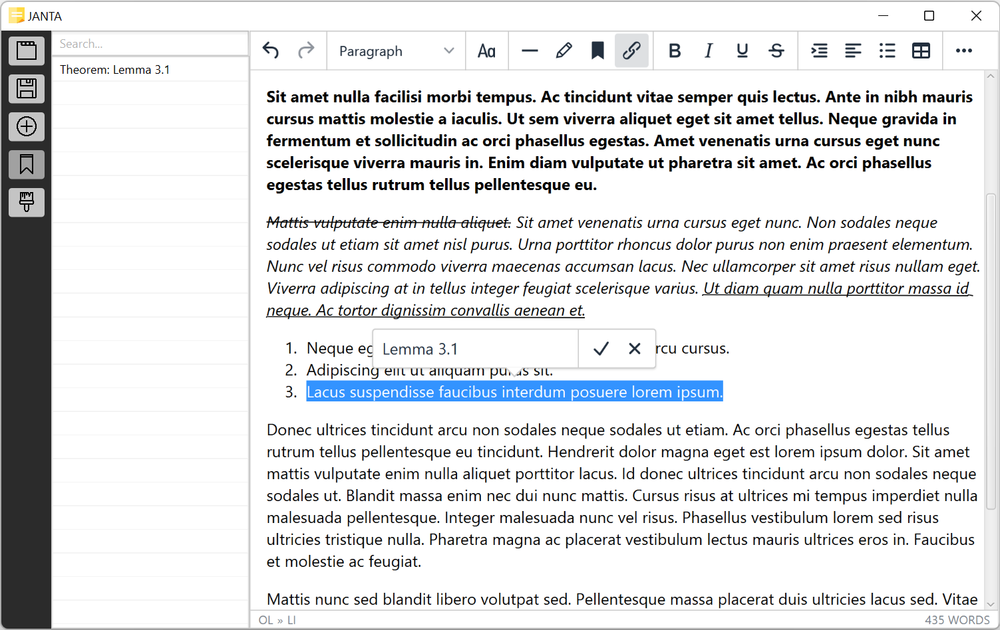
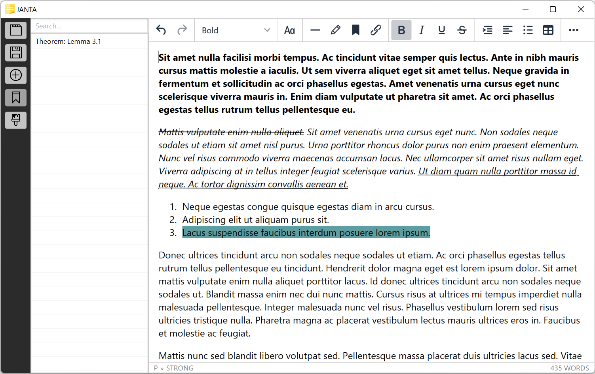

# JANTA: Just Another Note Taking App<a name="int"/>

JANTA is a full featured, note taking app targeted towards students taking notes for various academic curricula. Its features include Rich Text editing, autosave, and an awesome aesthetic. Also included in JANTA is an intuitive annotation and labeling system designed to allow users to structure and navigate notes in a manner uniquely suited to textbook-based content. JANTA is primarily written in Kotlin, but works with HTML under the hood using a `WebEngine`, allowing it to cleanly handle copy & pasting from webpages and other HTML editors.

# Instructions<a name="ins"/>

JANTA's interface should be fairly self explanatory. Regardless, below is a quick all-you-need-to-know.

The sidebar buttons, in order:

* Toggle note list1
* Save current note2
* Create new note
* Toggle label list3
* Toggle theme

1 Notes can be renamed and deleted by right clicking on the corresponding note in the note list.

2 JANTA saves the content in the current note any time you switch notes. Saving is also triggered by content commits; virtually any action taken in editor including clicking, applying a font, indenting, etc. Thus, the only time where you should manually save is when you intend to close the app immediately after typing a large amount of text.

3 The label list displays the label targets and references within the currently open note.

## Annotations and Labels

# Annotations

To add an annotation:

1. Select the text you wish to annotate
2. Use the button highlighted in the editor toolbar or the shortcut "Ctrl + P" to display the annotation popup
3. Enter the contents of the annotation
4. Press "Return" or click the checkmark to add the annotation

To edit an annotation:

1. Click to select anywhere witin the annotated text to display the annotation popup
2. Edit the contents of the annotation as desired
4. Press "Return" or click the checkmark to commit the edit

To delete an annotation:

1. Click to select anywhere witin the annotated text to display the annotation popup
2. Click the cross icon to delete the annotation

Annotatated text has a green background color, and hovering over it will display the annotation.

# Labels

Deletion of label targets and references are done through the exact same process as deleting annotations.

To add a label target:

1. Select the text you wish to designate a label target
2. Use the button highlighted in the editor toolbar or the shortcut "Ctrl + L" to display the label target popup
3. Enter the type of the label
4. Press "Return" or click the checkmark to proceed

5. Enter the name of the label. Duplicate names are not allowed
5. Press "Return" or click the checkmark to add the label target

Label targets have an orange background color, and hovering over them will display their name. Once added, label targets have their type and name displayed in the label list. The label list can be searched, and clicking on its items will navigate you to the corresponding label target in the note.

To add a label reference:

1. Select the text you wish to designate a label reference
2. Use the button highlighted in the editor toolbar or the shortcut "Ctrl + O" to display the label reference popup
3. Enter the name of the label target you wish to reference. Referencing a non-existent label target is not allowed
4. Press "Return" or click the checkmark to add the label reference

Label references have a turquoise background color.

## Shortcuts

| Action | Shortcut |
| ---      | ---      |
| **Bold** | Ctrl + B |
| *Italic* | Ctrl + I |
| <ins>Underline</ins> | Ctrl + U |
| Annotate | Ctrl + P |
| Label target | Ctrl + L |
| Label reference | Ctrl + O |
| Select all | Ctrl + A |
| Redo | Ctrl + Y or Ctrl + Shift + Z |
| Undo | Ctrl + Z |
| <h1>Heading 1</h1> | Shift + Alt + 1 |
| <h2>Heading 2</h2> | Shift + Alt + 2 |
| <h3>Heading 3</h3> | Shift + Alt + 3 |
| <h4>Heading 4</h4> | Shift + Alt + 4 |
| <h5>Heading 5</h5> | Shift + Alt + 5 |
| <h6>Heading 6</h6> | Shift + Alt + 6 |
| Paragraph | Shift + Alt + 7 |
| Open help dialog | Alt + 0 |
| Find | Ctrl + F |
